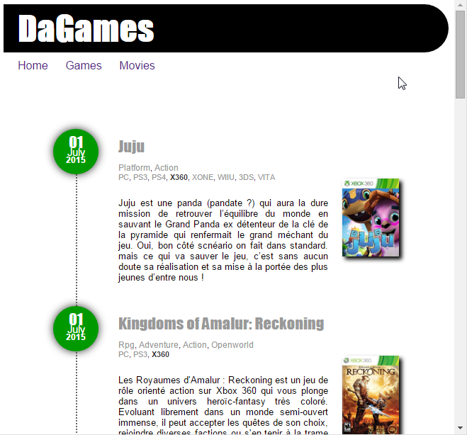

# Demo SpringBoot+AngularJS

[](https://ci.appveyor.com/project/Web-Context/demo "AppVeyor (win32) Build status")
[](https://travis-ci.org/Web-Context/demo "Travis-CI (linux) Build Status")


## DEMO

Some technical demo around multiple technologies.

- Blog: an HTML5+AngularJS smart designed blog with no input page, only reading; just testing some design.

```bash
$> cd blog
$> grunt serve
```

- DaBlog: another blog but thid time built with the yeoman generator (see [yeoman.io](http://yeoman.io "Visit the home of Sir Yeoman !"))

```bash
$> cd dablog/yo
$> grunt serve
$> cd ..
$> mvn spring-boot:run -Pmongodb
```

Using this "mongodb" maven profile, you will activate an embedded Mongodb database to serve DaBlog application.

Anyway here is the last design for the angularyo project :

<a href="./docs/images/posts_games_preview.png"></a>


------

## IDE Configuration

__Note__
To be able to import this project into Eclipse or STS, you will need to add some configuration to [`eclipse.ini`](config/eclipse-sample.ini "Download a sample file for Eclipse") or [`STS.ini`](config/STS-sample.ini "download a sample file for Spring Tools Suite"):

```ini
/skip to keep it readable
...
-javaagent:/home/frederic/.m2/repository/org/projectlombok/lombok/1.16.6/lombok-1.16.6.jar
-Xbootclasspath/a:/home/frederic/.m2/repository/org/projectlombok/lombok/1.16.6/lombok-1.16.6.jar
```


Have Fun !


[http://web-context.github.io](http://web-context.github.io "visit home of these demo")

McG.
